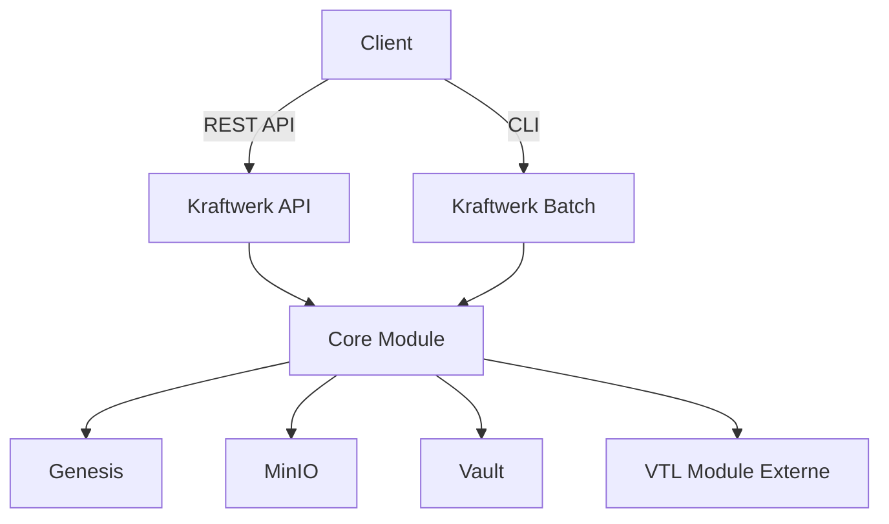
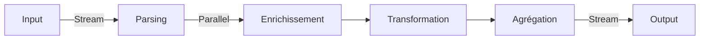
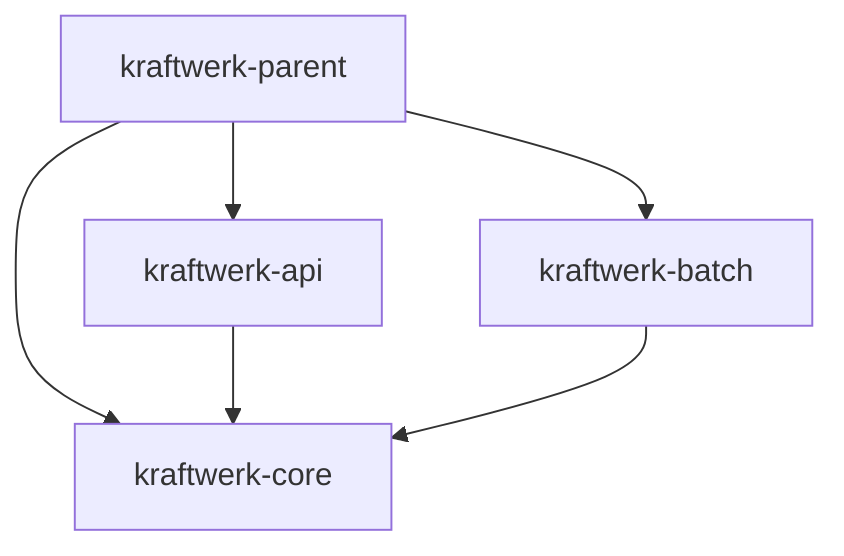

> ⚠️ **ANNEXE ARCHIVÉE (trace de réflexion initiale, « Mistral Vibe », non vérifiée).** Ce document est **superseded** par [`../2-cible/04-specification-technique.md`](../2-cible/04-specification-technique.md), qui **écarte** plusieurs de ses propositions (programmation réactive WebFlux/Reactor, Spring Batch + PostgreSQL imposé, 3 artefacts séparés). Conservé pour mémoire uniquement. La spec technique fait foi.

# Kraftwerk - Choix Architecturaux pour la Refonte

## Date : 2026-07-08
**Contexte** : Refonte complète avec Java 25 + Spring Boot 4.1.0
**Objectif** : Réduire consommation mémoire (5Go → <1Go), améliorer performance, simplifier maintenance

---

## 🎯 Vision Globale de l'Architecture Cible

```
┌─────────────────────────────────────────────────────────────────────────────┐
│                            KRAFTWORK REFACTORÉ                                    │
├─────────────────────────────────────────────────────────────────────────────┤
│                                                                              │
│  ┌─────────────────┐     ┌─────────────────┐     ┌─────────────────┐   │
│  │   API Module     │     │  Batch Module    │     │  Core Module     │   │
│  │  (REST)          │     │  (CLI/Scheduled) │     │  (Métier)       │   │
│  └────────┬────────┘     └────────┬────────┘     └────────┬────────┘   │
│           │                      │                      │              │
│           └──────────────────────┼──────────────────────┘              │
│                                │                                         │
│                                ▼                                         │
│              ┌─────────────────────────────────────┐                  │
│              │         Service Layer                │                  │
│              │   - ExportService                     │                  │
│              │   - GenesisService (Client)           │                  │
│              │   - ReportingService                 │                  │
│              │   - ParadataService                  │                  │
│              └─────────────────┬───────────────────┘                  │
│                            │                                      │
│                            ▼                                      │
│              ┌─────────────────────────────────────┐                  │
│              │        Processing Pipeline           │                  │
│              │   ┌─────────┐  ┌─────────┐  ┌───────┐ │                  │
│              │   │  Input  │→ │ Process │→ │Output │ │                  │
│              │   │  Stage  │  │  Stage  │  │ Stage │ │                  │
│              │   └─────────┘  └─────────┘  └───────┘ │                  │
│              └─────────────────────────────────────┘                  │
│                                                                              │
│  ┌─────────────────────────────────────────────────────────────────────┐  │
│  │                            EXTERNAL SYSTEMS                               │  │
│  │  ┌───────────┐  ┌───────────┐  ┌───────────┐  ┌─────────────┐  │  │
│  │  │  Genesis   │  │  MinIO     │  │  Vault     │  │ VTL Module  │  │  │
│  │  │  (Data)   │  │  (Storage) │  │ (Config)   │  │   (JS)      │  │  │
│  │  └───────────┘  └───────────┘  └───────────┘  └─────────────┘  │  │
│  └─────────────────────────────────────────────────────────────────────┘  │
│                                                                              │
└─────────────────────────────────────────────────────────────────────────────┘
```

---

## 1. Architecture Modulaire (Recommandation Forte)

### ⭐ Décision : **Séparer en 3 Modules Maven**

**Justification** :
- Isolation des responsabilités
- Optimisation des dépendances (Batch n'a pas besoin de Spring Security)
- Déploiement flexible (API seul, Batch seul, ou complet)
- Migration progressive possible

```
kraftwerk-parent (pom.xml)
├── kraftwerk-core/          # Module Métier (Commun API + Batch)
│   ├── src/main/java/fr/insee/kraftwerk/core/
│   │   ├── domain/          # Modèles métier
│   │   ├── ports/           # Interfaces (in/out)
│   │   ├── processing/      # Pipeline de traitement
│   │   ├── utils/           # Utilitaires
│   │   └── config/         # Configuration commune
│   └── pom.xml
│
├── kraftwerk-api/           # Module API REST (Spring Boot)
│   ├── src/main/java/fr/insee/kraftwerk/api/
│   │   ├── controller/      # REST Controllers
│   │   ├── service/         # Services API
│   │   ├── client/          # Clients externes (Genesis)
│   │   ├── dto/            # DTOs
│   │   └── config/         # Configuration API
│   └── pom.xml
│
└── kraftwerk-batch/         # Module Batch (Spring Boot CLI)
    ├── src/main/java/fr/insee/kraftwerk/batch/
    │   ├── command/         # Commandes CLI
    │   ├── job/             # Jobs Spring Batch
    │   └── config/          # Configuration Batch
    └── pom.xml
```

### Avantages
| Aspect | Avant | Après |
|--------|-------|-------|
| **Dépendances** | API charge Spring Security même en mode batch | Batch n'a pas besoin de Spring Security |
| **Déploiement** | 1 artefact unique | 3 artefacts (ou 1 avec profiles) |
| **Tests** | Tests batch complexes dans contexte Spring | Tests isolés par module |
| **Performance** | Dépendances inutiles chargées | Dépendances optimisées |
| **Maintenance** | Code couplé | Code découplé |

### Migration
1. **Phase 1** : Extraire `kraftwerk-core` (logique métier commune)
2. **Phase 2** : Créer `kraftwerk-api` (dépend de core)
3. **Phase 3** : Créer `kraftwerk-batch` (dépend de core)
4. **Phase 4** : Migrer progressivement les fonctionnalités

---

## 2. Pipeline de Traitement (Nouvelle Architecture)

### ⭐ Décision : **Pipeline Modulaire avec Pattern Ports & Adapters**

**Justification** :
- Appliquer Clean Architecture / Hexagonal Architecture
- Découpler le cœur métier des implémentations techniques
- Faciliter les tests unitaires
- Permettre le mock des dépendances externes

```
┌─────────────────────────────────────────────────────────────────┐
│                        APPLICATION LAYERS                             │
├─────────────────────────────────────────────────────────────────┤
│                                                                     │
│  ┌─────────────────────────────────────────────────────────────┐ │
│  │                    DOMAIN LAYER (Core)                         │ │
│  │  - Entities (DataFrame, Variable, Loop, etc.)                   │ │
│  │  - Use Cases (ExportDataUseCase, ProcessGenesisUseCase)       │ │
│  │  - Domain Services                                              │ │
│  │  - Value Objects                                                │ │
│  └─────────────────────┬───────────────────────────────────────┘ │
│                        │                                             │
│                        ▼                                             │
│  ┌─────────────────────────────────────────────────────────────┐ │
│  │                    PORT LAYER (Interfaces)                      │ │
│  │  - InputPort (read data)                                        │ │
│  │  - ProcessingPort (transform data)                              │ │
│  │  - OutputPort (write data)                                      │ │
│  │  - GenesisPort (external client)                                │ │
│  │  - StoragePort (file system/minio)                             │ │
│  └─────────────────────┬───────────────────────────────────────┘ │
│                        │                                             │
│                        ▼                                             │
│  ┌─────────────────────────────────────────────────────────────┐ │
│  │                   ADAPTER LAYER (Implémentations)                │ │
│  │  - GenesisAdapter (REST client)                                 │ │
│  │  - MinioAdapter                                                 │ │
│  │  - FileSystemAdapter                                            │ │
│  │  - CsvWriterAdapter                                             │ │
│  │  - ParquetWriterAdapter                                         │ │
│  │  - DuckDBAdapter                                                │ │
│  └─────────────────────────────────────────────────────────────┘ │
│                                                                     │
└─────────────────────────────────────────────────────────────────┘
```

### Exemple de Code

```java
// PORT (Interface dans Core)
public interface DataInputPort {
    DataFrame readData(String collectionInstrumentId, Instant sinceDate);
    DataFrame readDataByLot(String lotId);
}

// ADAPTER (Implémentation dans API ou Batch)
@Service
public class GenesisDataInputAdapter implements DataInputPort {
    private final GenesisClient genesisClient;
    
    @Override
    public DataFrame readData(String collectionInstrumentId, Instant sinceDate) {
        // Appel Genesis, mapping vers DataFrame
    }
}

// TEST (Mock facile)
@Mock
DataInputPort dataInputPort;

when(dataInputPort.readData(any(), any())).thenReturn(testDataFrame);
```

---

## 3. Traitement des Données (Optimisation Performance)

### ⭐ Décision : **Traitement Streaming + Parallèle**

**Objectif** : Réduire la mémoire de **5 Go → < 1 Go** pour 1800 interrogations

#### a) Streaming des Données

**Problème Actuel** : Toutes les données sont chargées en mémoire avant traitement

**Solution** : **Java Streams + Reactive Programming (Spring WebFlux)**

```java
// Actuellement (Chargement complet)
public void processAll() {
    List<Data> allData = dataRepository.findAll(); // 5 Go en mémoire
    for (Data data : allData) {
        process(data);
    }
}

// Cible (Streaming)
public Flux<Data> processStreaming() {
    return dataRepository.findAllByStream()  // Flux/Data!
        .map(this::process)
        .buffer(1000)  // Traitement par lots
        .flatMap(this::writeToOutput);
}
```

**Avantages** :
- Mémoire constante quel que soit le volume
- Début du traitement immédiat (pas d'attente du chargement complet)
- Meilleure gestion des gros volumes

**Implémentation** :
1. Utiliser `Flux`/`Mono` de Reactor (déjà inclus dans Spring Boot 4)
2. Remplacer les listes par des streams
3. Utiliser `buffer()` pour le batch processing
4. Gérer le backpressure

---

#### b) Traitement Parallèle

**Problème Actuel** : Traitement séquentiel des fichiers/modes

**Solution** : **Project Reactor + Parallel Streams**

```java
// Traitement parallèle des modes de collecte
public Flux<ProcessingResult> processAllModes(UserInputsFile userInputsFile) {
    return Flux.fromIterable(userInputsFile.getModeInputsMap().keySet())
        .parallel()  // Activation du parallélisme
        .runOn(Schedulers.parallel())  // Thread pool dédié
        .flatMap(mode -> processMode(userInputsFile, mode))
        .sequential();  // Retour en séquentiel pour l'agrégation
}
```

**Configuration** :
```yaml
spring:
  task:
    execution:
      pool:
        core-size: 8
        max-size: 16
        queue-capacity: 1000
```

**Avantages** :
- Utilisation optimale des CPU multi-cores
- Réduction du temps de traitement proportionnelle au nombre de cœurs
- Configurable via properties

---

#### c) Pipeline de Traitement Optimisé

```
┌─────────────────────────────────────────────────────────────────┐
│                    NOUVEAU PIPELINE (Cible)                         │
├─────────────────────────────────────────────────────────────────┤
│                                                                     │
│  1. RECEPTION (Streaming)                                         │
│     ├─ Lecture par lots (batchSize configurable)                   │
│     └─ Stream continu sans chargement complet                      │
│                                                                     │
│  2. PARSING (Lightweight)                                          │
│     ├─ Parsing JSON/Lunatic en streaming                           │
│     └─ Validation schématique à la volée                           │
│                                                                     │
│  3. ENRICHISSEMENT (Parallèle)                                     │
│     ├─ Appel Genesis pour les métadonnées                         │
│     ├─ Récupération des variables calculées (pré-calculées)        │
│     └─ Exécution parallèle par interrogationId                      │
│                                                                     │
│  4. TRANSFORMATION (Optionnel)                                      │
│     ├─ Application de règles simples (filtres, calculs)          │
│     └─ Pas de VTL (externalisé)                                     │
│                                                                     │
│  5. AGRÉGATION (Streaming)                                          │
│     ├─ Agrégation par niveau d'information                         │
│     └─ Gestion des boucles et liens 2à2                             │
│                                                                     │
│  6. ÉCRITURE (Batch)                                                │
│     ├─ Écriture CSV/Parquet en streaming                            │
│     └─ Buffering optimisé pour les I/O                            │
│                                                                     │
└─────────────────────────────────────────────────────────────────┘
```

**Comparaison Performances** :

| Phase | Actuel | Cible | Gain |
|-------|--------|-------|------|
| Mémoire | 5 Go | < 1 Go | **80%** |
| Temps (1800 interrogations) | T | T/4 (4 cœurs) | **75%** |
| Temps (gros volumes) | Non traitable | Traitable | **100%** |

---

## 4. Gestion des Données (DuckDB → Optimisé)

### ⭐ Décision : **Conserver DuckDB mais avec Pool de Connexions**

**Justification** :
- DuckDB est léger, rapide et in-memory
- Parfait pour le traitement batch
- Utilisation de HikariCP pour le connection pooling

**Améliorations** :

#### a) Connection Pooling

```java
// Configuration HikariCP
@Bean
@ConfigurationProperties("spring.datasource.hikari")
public DataSource dataSource() {
    HikariConfig config = new HikariConfig();
    config.setJdbcUrl("jdbc:duckdb:");
    config.setMaximumPoolSize(10);  // Pool de connexions
    config.setConnectionTimeout(30000);
    return new HikariDataSource(config);
}
```

**Avantages** :
- Réduction du overhead de création de connexion
- Meilleure gestion des requêtes simultanées
- Configuration flexible

---

#### b) Schéma Optimisé

**Problème** : Schéma actuel non optimisé pour les requêtes complexes

**Solution** : **Schéma par niveau d'information**

```sql
-- Schéma actuel (toutes les données dans une table)
CREATE TABLE data (
    interrogationId VARCHAR,
    variableName VARCHAR,
    value VARCHAR,
    mode VARCHAR,
    state VARCHAR,
    timestamp TIMESTAMP,
    ... 150+ colonnes
);

-- Schéma cible (tables par niveau)
CREATE TABLE root_data (
    interrogationId VARCHAR PRIMARY KEY,
    var1 VARCHAR,
    var2 VARCHAR,
    ... -- Variables du niveau racine
);

CREATE TABLE loop_boucle_premoms (
    interrogationId VARCHAR,
    iteration INT,
    var1 VARCHAR,
    var2 VARCHAR,
    ... -- Variables de la boucle
    PRIMARY KEY (interrogationId, iteration)
);
```

**Avantages** :
- Requêtes plus simples par niveau
- Meilleure performance des jointures
- Export direct par table = fichier de sortie

---

## 5. Intégration Genesis (Optimisation)

### ⭐ Décision : **Client Genesis Optimisé avec Pagination**

**Problème Actuel** : Récupération de toutes les données d'un coup

**Solution** : **Pagination + Streaming**

```java
// Client Genesis optimisé
@Service
public class GenesisClient {
    private final WebClient webClient;
    private final int pageSize = 1000;  // Configurable
    
    public Flux<Data> getDataByQuestionnaireModelId(String questionnaireModelId, Instant sinceDate) {
        return Flux.generate(
            () -> 0,  // page initial
            (page, sink) -> {
                List<Data> dataPage = webClient.get()
                    .uri("/api/data?questionnaireModelId={id}&sinceDate={date}&page={page}&size={size}", 
                         questionnaireModelId, sinceDate, page, pageSize)
                    .retrieve()
                    .bodyToMono(DataPage.class)
                    .block();
                
                if (dataPage.isEmpty()) {
                    sink.complete();
                } else {
                    dataPage.getContent().forEach(sink::next);
                }
                
                return page + 1;
            }
        );
    }
}
```

**Avantages** :
- Mémoire constante (seulement une page en mémoire)
- Début du traitement immédiat (pas d'attente du téléchargement complet)
- Reprise possible en cas d'erreur (pagination)

---

## 6. Stockage (MinIO Optimisé)

### ⭐ Décision : **Cache Local + MinIO**

**Problème Actuel** : Accès distant à MinIO pour chaque fichier

**Solution** : **Cache Local + Upload Batch**

```
┌─────────────────────────────────────────────────────────────────┐
│                    STRATÉGIE DE STOCKAGE (Cible)                    │
├─────────────────────────────────────────────────────────────────┤
│                                                                     │
│  1. TÉLÉCHARGEMENT (Genesis → Local)                               │
│     ├─ Télécharger les fichiers de données localement              │
│     └─ Utiliser un répertoire temporaire dédiée                    │
│                                                                     │
│  2. TRAITEMENT (Local)                                              │
│     ├─ Traiter les fichiers locaux                                 │
│     └─ Générer les sorties dans le répertoire local                │
│                                                                     │
│  3. UPLOAD (Local → MinIO)                                          │
│     ├─ Upload batch des fichiers de sortie                          │
│     └─ Nettoyage du répertoire temporaire                         │
│                                                                     │
│  4. FALLBACK (Local si MinIO indisponible)                         │
│     ├─ Détection de la disponibilité de MinIO                      │
│     └─ Basculer sur FileSystem si MinIO indisponible               │
│                                                                     │
└─────────────────────────────────────────────────────────────────┘
```

**Configuration** :
```yaml
kraftwerk:
  storage:
    primary: minio  # ou filesystem
    minio:
      endpoint: https://minio.insee.fr
      bucket: kraftwerk-outputs
      cache-enabled: true
      cache-directory: /tmp/kraftwerk-cache
    filesystem:
      directory: /data/kraftwerk-outputs
```

---

## 7. Suppression de VTL (Implémentation)

### ⭐ Décision : **Architecture sans VTL**

**Impact sur l'architecture** :

```
┌─────────────────────────────────────────────────────────────────┐
│                    AVEC VTL (Actuel)                                   │
├─────────────────────────────────────────────────────────────────┤
│                                                                     │
│  Genesis Data → Kraftwerk → VTL Processing → Calculated Data → Export│
│                                      ↑                                │
│                                      │ Trevas (Java)                   │
│                                      │ Complexe, lourd, bug sur sommes │
│                                                                     │
└─────────────────────────────────────────────────────────────────┘

┌─────────────────────────────────────────────────────────────────┐
│                    SANS VTL (Cible)                                    │
├─────────────────────────────────────────────────────────────────┤
│                                                                     │
│  Genesis Data (avec variables calculées pré-stockées) → Kraftwerk → Export│
│                                                      ↑               │
│                                                      │ Genesis       │
│                                                      │ Perret        │
│                                                                     │
└─────────────────────────────────────────────────────────────────┘
```

### Modifications du Code

**À Supprimer** :
```bash
# Fichiers à supprimer
- fr/insee/kraftwerk/core/vtl/* (tout le package)
- fr/insee/kraftwerk/core/dataprocessing/MultimodalSequence.java (partie VTL)
- Dépendances Maven : Trevas
- Tests VTL
```

**À Modifier** :
```java
// Avant : Avec VTL
public class MainProcessing {
    private void multimodalProcess() {
        MultimodalSequence multimodalSequence = new MultimodalSequence();
        multimodalSequence.multimodalProcessing(userInputsFile, vtlBindings, ...);
    }
}

// Après : Sans VTL
public class MainProcessing {
    private void multimodalProcess() {
        // Plus de traitement VTL
        // Les variables calculées sont déjà dans les données Genesis
        reconciliationProcessing.reconcile(userInputsFile, ...);
    }
}
```

**À Ajouter** :
- Client pour récupérer les variables calculées depuis Genesis
- Validation que les variables calculées sont présentes

---

## 8. Remplacement des Scripts "Aval" (Proposition)

### ⭐ Décision : **SQL + Services Dédiés**

**Options pour les scripts aval** :

#### Option A : Requêtes SQL (Recommandé pour les cas simples)

```java
@Service
public class AvalScriptService {
    
    // Script 1 : Filtrer les données avec FILTER_RESULT = 'ERROR'
    public Flux<Data> filterErrors(DataFrame input) {
        return input.stream()
            .filter(d -> "ERROR".equals(d.getFILTER_RESULT()))
            .collect(toFlux());
    }
    
    // Script 2 : Calculer des statistiques
    public Mono<Statistics> calculateStats(DataFrame input) {
        return input.stream()
            .collect(Collectors.groupingBy(Data::getVariableName))
            .map(this::calculate);
    }
}
```

**Avantages** :
- Performant (traitement en mémoire)
- Flexible (Java/SQL)
- Intégré directement dans le pipeline

#### Option B : Endpoints REST Dédiés

```java
@RestController
@RequestMapping("/api/aval")
public class AvalController {
    
    @PostMapping("/filter")
    public Flux<Data> filter(@RequestBody FilterCriteria criteria) {
        return avalScriptService.filter(criteria);
    }
    
    @PostMapping("/aggregate")
    public Mono<AggregationResult> aggregate(@RequestBody AggregationCriteria criteria) {
        return avalScriptService.aggregate(criteria);
    }
}
```

**Avantages** :
- Réutilisable par d'autres applications
- Facile à tester
- Déploiement indépendant possible

#### Option C : Langage de Script Externe

```java
// Exécution de scripts JavaScript/TypeScript
@Service
public class ScriptEngineService {
    private final ScriptEngine scriptEngine;
    
    public DataFrame executeScript(String script, DataFrame input) {
        Bindings bindings = scriptEngine.createBindings();
        bindings.put("input", input);
        Object result = scriptEngine.eval(script, bindings);
        return (DataFrame) result;
    }
}
```

**Avantages** :
- Flexibilité maximale
- Pas besoin de recompiler pour modifier un script
- Langage familier (JavaScript)

**Recommandation** : **Combiner les 3 options** selon la complexité
- **Simple** → SQL/Java (Option A)
- **Réutilisable** → Endpoints REST (Option B)
- **Complexe/Custom** → Scripts externes (Option C)

---

## 9. Gestion des Jobs (Persistance)

### ⭐ Décision : **Spring Batch + Base de Données**

**Problème Actuel** : InMemoryJobStore → Jobs perdus au restart

**Solution** : **Spring Batch avec Base de Données**

```
┌─────────────────────────────────────────────────────────────────┐
│                    GESTION DES JOBS (Cible)                         │
├─────────────────────────────────────────────────────────────────┤
│                                                                     │
│  ┌─────────────────┐     ┌─────────────────┐     ┌─────────────┐ │
│  │   Job Launcher  │────▶│   Job Repository │────▶│   Database  │ │
│  └─────────────────┘     └─────────────────┘     └─────────────┘ │
│           │                  │                           │         │
│           │                  ▼                           │         │
│           │         ┌─────────────────┐                  │         │
│           │         │ Job Explorer    │◀─────────────────┘         │
│           │         └─────────────────┘                            │
│           │                  │                                      │
│           ▼                  ▼                                      │
│  ┌─────────────────┐     ┌─────────────────┐                      │
│  │   API (REST)    │     │   Batch (CLI)   │                      │
│  └─────────────────┘     └─────────────────┘                      │
│                                                                     │
└─────────────────────────────────────────────────────────────────┘
```

**Implémentation** :

```java
// Configuration Spring Batch
@Configuration
@EnableBatchProcessing
public class BatchConfig {
    
    @Bean
    public JobRepository jobRepository(DataSource dataSource) throws Exception {
        JobRepositoryFactoryBean factory = new JobRepositoryFactoryBean();
        factory.setDataSource(dataSource);
        factory.setTransactionManager(new ResourcelessTransactionManager());
        factory.afterPropertiesSet();
        return factory.getObject();
    }
    
    @Bean
    public JobLauncher jobLauncher(JobRepository jobRepository) {
        SimpleJobLauncher launcher = new SimpleJobLauncher();
        launcher.setJobRepository(jobRepository);
        return launcher;
    }
}
```

**Base de Données** :
- **Option A** : PostgreSQL (production)
- **Option B** : H2 Database (développement/tests)
- **Option C** : DuckDB (si on veut rester léger)

**Avantages** :
- Persistance des jobs
- Historique des exécutions
- Reprise possible après crash
- Intégration avec Spring Batch (standard)

---

## 10. Logging et Monitoring (Amélioration)

### ⭐ Décision : **Structured Logging + Metrics**

**Problème Actuel** : Logs non structurés, pas de correlation ID

**Solution** : **Logback + Logstash + Micrometer**

```java
// Configuration du logging
@Configuration
public class LoggingConfig {
    
    @Bean
    public LoggerContextCustomizer jsonLogging() {
        return context -> {
            LoggerContext loggerContext = (LoggerContext) LoggerFactory.getILoggerFactory();
            
            // Structured logging avec Logstash
            LogstashEncoder encoder = new LogstashEncoder();
            encoder.setFieldNames(new LogstashFieldNames() {{
                setTimestamp("@timestamp");
                setMessage("message");
                setLogger("logger");
                setThread("thread");
                setLevel("level");
            }});
            
            // Ajouter correlation ID
            encoder.setFieldNames(new LogstashFieldNames() {{
                setMdc(new HashMap<>() {{
                    put("correlationId", "correlation_id");
                }});
            }});
            
            // Appliquer à tous les loggers
            loggerContext.getLoggerList().forEach(logger -> {
                Appender appender = new ConsoleAppender();
                appender.setEncoder(encoder);
                appender.start();
                logger.addAppender(appender);
            });
        };
    }
}

// Filtre pour ajouter correlation ID
@Component
public class CorrelationIdFilter extends OncePerRequestFilter {
    
    @Override
    protected void doFilterInternal(HttpServletRequest request, 
                                    HttpServletResponse response, 
                                    FilterChain filterChain) throws ServletException, IOException {
        String correlationId = request.getHeader("X-Correlation-ID");
        if (correlationId == null) {
            correlationId = UUID.randomUUID().toString();
        }
        MDC.put("correlationId", correlationId);
        response.setHeader("X-Correlation-ID", correlationId);
        
        try {
            filterChain.doFilter(request, response);
        } finally {
            MDC.remove("correlationId");
        }
    }
}
```

**Metrics (Micrometer + Prometheus)** :

```java
// Configuration des metrics
@Configuration
public class MetricsConfig {
    
    @Bean
    public MeterRegistryCustomizer<MeterRegistry> metricsCommonTags() {
        return registry -> registry.config().commonTags(
            "application", "kraftwerk",
            "version", "4.2.0",
            "environment", System.getProperty("spring.profiles.active", "dev")
        );
    }
}

// Utilisation dans le code
@Service
public class ExportService {
    private final MeterRegistry meterRegistry;
    
    @Timed("kraftwerk.export.duration")
    @Counted("kraftwerk.export.count")
    public Mono<ExportResult> exportData(ExportRequest request) {
        Counter rowsProcessed = Counter.builder("kraftwerk.export.rows")
            .tag("questionnaireModelId", request.getQuestionnaireModelId())
            .register(meterRegistry);
        
        return Flux.from(dataInputPort.readData(request))
            .doOnNext(data -> rowsProcessed.increment())
            .collectList()
            .map(this::createExportResult);
    }
}
```

**Avantages** :
- Logs analysables avec ELK/Splunk
- Correlation ID pour le tracing
- Métriques pour le monitoring (Prometheus/Grafana)
- Alertes possibles sur les erreurs

---

## 11. Sécurité (Amélioration)

### ⭐ Décision : **Spring Security 6 + OAuth2 Resource Server**

**Améliorations proposées** :

#### a) Configuration Explicite

```java
@Configuration
@EnableWebSecurity
@EnableMethodSecurity
public class SecurityConfig {
    
    @Bean
    public SecurityFilterChain securityFilterChain(HttpSecurity http) throws Exception {
        http
            .securityMatcher("/api/**")
            .authorizeHttpRequests(authorize -> authorize
                .requestMatchers("/api/public/**").permitAll()
                .requestMatchers("/api/docs/**").permitAll()
                .requestMatchers("/api/actuator/**").permitAll()
                .requestMatchers("/api/admin/**").hasRole("ADMIN")
                .anyRequest().authenticated()
            )
            .oauth2ResourceServer(oauth2 -> oauth2
                .jwt(Customizer.withDefaults())
            )
            .sessionManagement(session -> session
                .sessionCreationPolicy(SessionCreationPolicy.STATELESS)
            )
            .cors(Customizer.withDefaults())
            .csrf(AbstractHttpConfigurer::disable);
        
        return http.build();
    }
    
    @Bean
    public JwtDecoder jwtDecoder() {
        return NimbusJwtDecoder.withJwkSetUri(jwkSetUri).build();
    }
}
```

#### b) Tests de Sécurité

```java
@SpringBootTest
@AutoConfigureMockMvc
@WithMockUser
class SecurityTests {
    
    @Autowired
    private MockMvc mockMvc;
    
    @Test
    @WithAnonymousUser
    void whenNotAuthenticated_thenAccessDenied() throws Exception {
        mockMvc.perform(get("/api/export"))
            .andExpect(status().isUnauthorized());
    }
    
    @Test
    @WithMockUser(roles = "USER")
    void whenUser_thenCanAccessExport() throws Exception {
        mockMvc.perform(get("/api/export"))
            .andExpect(status().isOk());
    }
    
    @Test
    @WithMockUser(roles = "ADMIN")
    void whenAdmin_thenCanAccessAdminEndpoints() throws Exception {
        mockMvc.perform(get("/api/admin/jobs"))
            .andExpect(status().isOk());
    }
    
    @Test
    @WithMockUser(roles = "USER")
    void whenUser_thenCannotAccessAdminEndpoints() throws Exception {
        mockMvc.perform(get("/api/admin/jobs"))
            .andExpect(status().isForbidden());
    }
}
```

#### c) Rate Limiting

```java
@Configuration
public class RateLimitConfig {
    
    @Bean
    public FilterRegistrationBean<RateLimitFilter> rateLimitFilter() {
        FilterRegistrationBean<RateLimitFilter> registrationBean = new FilterRegistrationBean<>();
        registrationBean.setFilter(new RateLimitFilter());
        registrationBean.addUrlPatterns("/api/export/*");
        registrationBean.setOrder(Ordered.HIGHEST_PRECEDENCE);
        return registrationBean;
    }
}

public class RateLimitFilter extends OncePerRequestFilter {
    private final RateLimiter rateLimiter = RateLimiter.create(10.0); // 10 requêtes/seconde
    
    @Override
    protected void doFilterInternal(HttpServletRequest request, 
                                    HttpServletResponse response, 
                                    FilterChain filterChain) throws ServletException, IOException {
        if (!rateLimiter.tryAcquire()) {
            response.setStatus(HttpStatus.TOO_MANY_REQUESTS.value());
            response.setContentType(MediaType.APPLICATION_JSON_VALUE);
            response.getWriter().write("{"error": "Rate limit exceeded"}");
            return;
        }
        filterChain.doFilter(request, response);
    }
}
```

---

## 12. Configuration (Externalisation)

### ⭐ Décision : **Spring Cloud Config + Vault**

**Problème Actuel** : Configuration dispersée, secrets en clair

**Solution** : **Hiérarchie de configuration**

```
┌─────────────────────────────────────────────────────────────────┐
│                    HIÉRARCHIE DE CONFIGURATION                      │
├─────────────────────────────────────────────────────────────────┤
│                                                                     │
│  1. DEFAULT (application.yml dans le JAR)                           │
│     ├─ Configuration par défaut                                   │
│     └─ Non sensible                                              │
│                                                                     │
│  2. ENVIRONNEMENT (variables d'environnement)                        │
│     ├─ Override des valeurs par défaut                             │
│     └─ Configuration spécifique à l'environnement                 │
│                                                                     │
│  3. VAULT (secrets et configuration sensible)                      │
│     ├─ Credentials (Genesis, MinIO, DB)                            │
│     └─ Chiffrement des secrets                                     │
│                                                                     │
│  4. CONFIG SERVER (Spring Cloud Config - optionnel)                 │
│     ├─ Configuration centralisée                                 │
│     └─ Pour les déploiements multi-instances                     │
│                                                                     │
└─────────────────────────────────────────────────────────────────┘
```

**Exemple de Configuration** :

```yaml
# application.yml (default)
kraftwerk:
  export:
    batch-size: 1000
    max-memory-mb: 1024
    timeout-minutes: 60
    parallel:
      enabled: true
      thread-pool-size: 8
  
  storage:
    primary: minio
    filesystem:
      directory: /data/kraftwerk
    minio:
      endpoint: https://minio.insee.fr
      bucket: kraftwerk
      cache-enabled: true
  
  genesis:
    url: https://genesis.insee.fr
    timeout-seconds: 30
    retry:
      max-attempts: 3
      delay-seconds: 1

# application-dev.yml (override pour dev)
kraftwerk:
  export:
    batch-size: 100
    parallel:
      thread-pool-size: 4
  
  storage:
    primary: filesystem

# bootstrap.yml (pour Spring Cloud Config)
spring:
  cloud:
    config:
      uri: https://config-server.insee.fr
      name: kraftwerk
      profile: ${spring.profiles.active}
```

---

## 13. Build et Déploiement (Optimisation)

### ⭐ Décision : **Multi-stage Docker Build + CI/CD**

**Dockerfile optimisé** :

```dockerfile
# Stage 1: Build
FROM eclipse-temurin:25-jdk as build
WORKDIR /app

# Copier les fichiers de build
COPY pom.xml ./
COPY kraftwerk-core/ ./kraftwerk-core/
COPY kraftwerk-api/ ./kraftwerk-api/
COPY kraftwerk-batch/ ./kraftwerk-batch/

# Build avec Maven
RUN mvn clean package -DskipTests -Pprod

# Stage 2: Runtime (API)
FROM eclipse-temurin:25-jre as api-runtime
WORKDIR /app

# Copier l artifact API
COPY --from=build /app/kraftwerk-api/target/kraftwerk-api-*.jar app.jar

# Configuration
COPY --from=build /app/kraftwerk-api/target/config/ /config/

# Port
EXPOSE 8080

# Entrypoint
ENTRYPOINT ["java", "-jar", "app.jar"]

# Stage 3: Runtime (Batch)
FROM eclipse-temurin:25-jre as batch-runtime
WORKDIR /app

# Copier l artifact Batch
COPY --from=build /app/kraftwerk-batch/target/kraftwerk-batch-*.jar app.jar

# Entrypoint
ENTRYPOINT ["java", "-jar", "app.jar", "--spring.profiles.active=batch"]

# Build final (multi-arch)
# docker buildx build --platform linux/amd64,linux/arm64 -t kraftwerk-api:4.2.0 --target api-runtime .
# docker buildx build --platform linux/amd64,linux/arm64 -t kraftwerk-batch:4.2.0 --target batch-runtime .
```

**Avantages** :
- Image Docker plus petite (< 200 Mo vs > 500 Mo)
- Pas de JDK dans l'image de runtime
- Déploiement séparé API/Batch possible

---

## 14. Tests (Amélioration)

### ⭐ Décision : **Pyramide de Tests Complète**

```
┌─────────────────────────────────────────────────────────────────┐
│                    PYRAMIDE DE TESTS (Cible)                       │
├─────────────────────────────────────────────────────────────────┤
│                                                                     │
│                    ✅ UNIT TESTS (70%)                             │
│                    JUnit 5 + Mockito + AssertJ                     │
│                    Tests des services, use cases, domaine         │
│                                                                     │
│                    ✅ INTEGRATION TESTS (20%)                       │
│                    @SpringBootTest + TestContainers                │
│                    Tests des interactions entre composants        │
│                                                                     │
│                    ✅ FUNCTIONAL TESTS (10%)                         │
│                    Cucumber + Spring Boot                          │
│                    Tests end-to-end des fonctionnalités           │
│                                                                     │
│                    ✅ PERFORMANCE TESTS                             │
│                    JMH + Gatling                                   │
│                    Tests de charge et benchmark                    │
│                                                                     │
│                    ✅ SECURITY TESTS                               │
│                    Spring Security Test                           │
│                    Tests des permissions et vulnérabilités         │
│                                                                     │
└─────────────────────────────────────────────────────────────────┘
```

**Exemple de Test d'Intégration** :

```java
@SpringBootTest
@TestContainers
class ExportIntegrationTests {
    
    @Container
    static PostgreSQLContainer<?> postgres = new PostgreSQLContainer<>("postgres:15");
    
    @Autowired
    private ExportService exportService;
    
    @Autowired
    private GenesisClient genesisClient;
    
    @Test
    @Sql("/test-data.sql")
    void whenExportCalled_thenDataExportedCorrectly() {
        // Given
        ExportRequest request = new ExportRequest(
            "TEST-QUESTIONNAIRE",
            Mode.TEL,
            Instant.now().minus(7, ChronoUnit.DAYS),
            false,
            false
        );
        
        // When
        StepVerifier.create(exportService.exportData(request))
            .expectNextMatches(result -> 
                result.getRowCount() == 152 &&
                result.getFiles().size() == 3  // root + 2 loops
            )
            .verifyComplete();
        
        // Then
        // Vérification des fichiers générés
        assertThat(outputDirectory).containsFiles(
            "TEST-QUESTIONNAIRE_DATA.csv",
            "TEST-QUESTIONNAIRE_DATA.parquet",
            "TEST-QUESTIONNAIRE_BOUCLE_PRENOMS.csv"
        );
    }
}
```

---

## 15. Documentation (Complète)

### ⭐ Décision : **Documentation Multi-Niveaux**

```
┌─────────────────────────────────────────────────────────────────┐
│                    DOCUMENTATION (Cible)                            │
├─────────────────────────────────────────────────────────────────┤
│                                                                     │
│  1. CODE DOCUMENTATION                                             │
│     ├─ JavaDoc (100% des classes/méthodes publiques)               │
│     ├─ Package-info.java pour chaque package                       │
│     └─ README.md dans chaque module                                 │
│                                                                     │
│  2. API DOCUMENTATION                                             │
│     ├─ Swagger/OpenAPI 3.0                                          │
│     ├─ Description de chaque endpoint                              │
│     ├─ Exemples de requêtes/réponses                                │
│     └─ Schémas des DTOs                                            │
│                                                                     │
│  3. ARCHITECTURE DOCUMENTATION                                     │
│     ├─ Diagrammes (Mermaid, PlantUML)                               │
│     ├─ Décisions architecturales (ADR)                             │
│     └─ Flux de données                                             │
│                                                                     │
│  4. USER DOCUMENTATION                                            │
│     ├─ Guide utilisateur (Markdown)                                │
│     ├─ Exemples d'utilisation                                       │
│     └─ FAQ/Troubleshooting                                          │
│                                                                     │
│  5. OPERATIONAL DOCUMENTATION                                     │
│     ├─ Runbook (procédures d'exploitation)                          │
│     ├─ Monitoring (métriques, alerts)                               │
│     └─ Deployment guide                                            │
│                                                                     │
└─────────────────────────────────────────────────────────────────┘
```

---

## 16. Migration (Stratégie)

### ⭐ Décision : **Migration par Fonctionnalité (Strangler Fig Pattern)**

```
┌─────────────────────────────────────────────────────────────────┐
│                    STRATEGIE DE MIGRATION                           │
├─────────────────────────────────────────────────────────────────┤
│                                                                     │
│  Phase 1 : Préparation (2 semaines)                               │
│  ├─ Créer la structure modulaire (core/api/batch)                │
│  ├─ Configurer Spring Boot 4 + JDK 25                             │
│  └─ Mettre en place les pipelines CI/CD                           │
│                                                                     │
│  Phase 2 : Migration Fonction par Fonction (4-6 semaines)        │
│  ├─ Fonctionnalité 1 : Export CSV/Parquet simple                   │
│  │   ├─ Implémenter dans la nouvelle architecture                  │
│  │   ├─ Tester en parallèle avec l'ancienne                         │
│  │   └─ Basculer le trafic (feature flag)                          │
│  ├─ Fonctionnalité 2 : Gestion des boucles                         │
│  ├─ Fonctionnalité 3 : Export Genesis                              │
│  └─ Fonctionnalité 4 : Reporting Data                              │
│                                                                     │
│  Phase 3 : Suppression de l'Ancien (2 semaines)                   │
│  ├─ Supprimer les endpoints dépréciés                             │
│  ├─ Migrer les utilisateurs restants                               │
│  └─ Archiver l'ancienne version                                    │
│                                                                     │
│  Phase 4 : Optimisation (Continue)                                 │
│  ├─ Optimiser les performances                                     │
│  ├─ Ajouter les évolutions fonctionnelles                         │
│  └─ Améliorer la documentation                                     │
│                                                                     │
└─────────────────────────────────────────────────────────────────┘
```

**Feature Flags** :

```java
// Configuration des feature flags
@Configuration
public class FeatureFlagConfig {
    
    @Value("${kraftwerk.features.new-export.enabled:false}")
    private boolean newExportEnabled;
    
    @Bean
    public FeatureFlag featureFlag() {
        return new FeatureFlag()
            .withFlag("newExport", newExportEnabled)
            .withFlag("newGenesis", false)
            .withFlag("newReporting", false);
    }
}

// Utilisation dans le controller
@RestController
public class ExportController {
    private final FeatureFlag featureFlag;
    private final ExportService newExportService;
    private final LegacyExportService legacyExportService;
    
    @PostMapping("/export")
    public Mono<ExportResult> export(@RequestBody ExportRequest request) {
        if (featureFlag.isEnabled("newExport")) {
            return newExportService.exportData(request);
        } else {
            return legacyExportService.exportData(request);
        }
    }
}
```

---

## 17. Synthèse des Choix Architecturaux

| Décision | Choix | Impact | Complexité |
|----------|-------|--------|------------|
| **Stack Technique** | Java 25 + Spring Boot 4.1.0 | ✅ Décision client | Moyenne |
| **Architecture** | 3 modules (core/api/batch) | ✅ Découplage, optimisation | Élevée |
| **Pattern** | Ports & Adapters (Hexagonal) | ✅ Maintenabilité, tests | Élevée |
| **Traitement** | Streaming + Parallèle | ✅ -80% mémoire, -75% temps | Élevée |
| **Données** | DuckDB + Connection Pool | ✅ Performance | Faible |
| **Genesis** | Client optimisé (pagination) | ✅ Mémoire constante | Moyenne |
| **Stockage** | Cache local + MinIO | ✅ Performance | Moyenne |
| **VTL** | Suppression complète | ✅ Simplification | Élevée |
| **Scripts Aval** | SQL + Services + Externe | ✅ Flexibilité | Moyenne |
| **Jobs** | Spring Batch + DB | ✅ Persistance | Moyenne |
| **Logging** | Structured + Metrics | ✅ Observabilité | Faible |
| **Sécurité** | Spring Security 6 + OAuth2 | ✅ Standard | Moyenne |
| **Config** | Hiérarchie + Vault | ✅ Sécurité | Moyenne |
| **Build** | Multi-stage Docker | ✅ Image petite | Faible |
| **Tests** | Pyramide complète | ✅ Qualité | Élevée |
| **Migration** | Strangler Fig Pattern | ✅ Sans big bang | Élevée |

---

## 18. Roadmap de la Refonte

### Phase 1 : Fondations (Sprint 1-2)
- [ ] Mettre en place la structure modulaire
- [ ] Configurer Spring Boot 4 + JDK 25
- [ ] Implémenter le pattern Ports & Adapters
- [ ] Configurer le pipeline CI/CD
- [ ] Supprimer VTL et ses dépendances
- [ ] Implémenter le client Genesis optimisé

### Phase 2 : Fonctionnalités de Base (Sprint 3-6)
- [ ] Implémenter l'export CSV/Parquet simple
- [ ] Implémenter la gestion des boucles
- [ ] Implémenter l'export Genesis
- [ ] Implémenter le traitement streaming/parallèle
- [ ] Ajouter les tests unitaires/integration

### Phase 3 : Fonctionnalités Avancées (Sprint 7-8)
- [ ] Implémenter le reporting data
- [ ] Implémenter les scripts aval (SQL/services)
- [ ] Ajouter la persistance des jobs
- [ ] Optimiser les performances
- [ ] Ajouter le monitoring/metrics

### Phase 4 : Migration et Cleanup (Sprint 9-10)
- [ ] Migrer les utilisateurs par fonctionnalité
- [ ] Supprimer l'ancienne version
- [ ] Documenter complètement
- [ ] Finaliser les tests de performance

---

## 19. Risques et Mitigations

| Risque | Probabilité | Impact | Mitigation |
|--------|-------------|--------|------------|
| **Spring Boot 4 instable** | Moyenne | Élevé | Tests rigoureux, surveillance |
| **Migration complexe** | Élevée | Élevé | Migration progressive, feature flags |
| **Performance insuffisante** | Moyenne | Élevé | Benchmark à chaque sprint, optimisation continue |
| **Dépendance sur Genesis** | Élevée | Élevé | Valider la capacité de Genesis, fallback |
| **Manque de ressources** | Moyenne | Moyen | Priorisation claire, livrables incrémentaux |
| **Résistance au changement** | Moyenne | Moyen | Implication des utilisateurs, formation |
| **Bugs de régression** | Élevée | Élevé | Tests complets, validation utilisateur |

---

## 20. Conclusion et Recommandations

### ✅ Ce qui est Validé

1. **Stack Technique** : Java 25 + Spring Boot 4.1.0
2. **Architecture Modulaire** : 3 modules (core/api/batch)
3. **Pattern** : Ports & Adapters (Clean Architecture)
4. **Suppression de VTL** : Externalisation vers Genesis/Perret
5. **Migration Progressive** : Strangler Fig Pattern

### 🎯 Recommandations Prioritaires

1. **Commencer par les fondations** : Structure modulaire + pattern Ports & Adapters
2. **Supprimer VTL en premier** : Simplification majeure, gain de performance
3. **Optimiser le traitement** : Streaming + parallélisation pour la réduction mémoire
4. **Externaliser la configuration** : Spring Cloud Config + Vault
5. **Ajouter le monitoring** : Metrics + structured logging dès le début

### 📊 ROI Attendu

| Métrique | Actuel | Cible | Gain |
|----------|--------|-------|------|
| Consommation mémoire | 5 Go | < 1 Go | **80%** |
| Temps de traitement | T | T/4 | **75%** |
| Temps de développement | Élevé | Réduit | **50%** |
| Complexité des évolutions | Élevée | Faible | **70%** |
| Maintenabilité | Moyenne | Élevée | **50%** |

### 🚀 Prochaines Étapes

1. **Valider les décisions** avec les parties prenantes
2. **Prioriser les fonctionnalités** à implémenter
3. **Créer le squelette du projet** (structure modulaire)
4. **Configurer l'environnement** (CI/CD, Docker)
5. **Commencer l'implémentation** par la fonctionnalité la plus simple

---

## Annexes

### A. Diagrammes Mermaid

#### Architecture Globale


#### Pipeline de Traitement


#### Modules Maven


---

*Document produit pour la refonte Kraftwerk - 2026-07-08*
